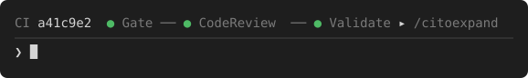
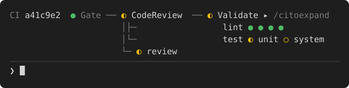
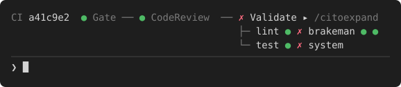
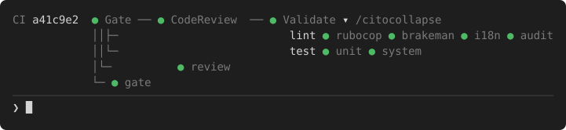
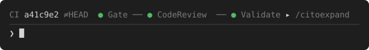
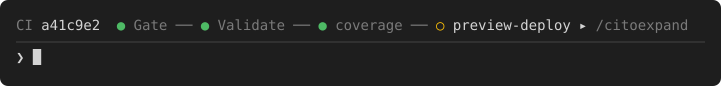
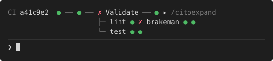
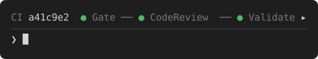

# ci-line

A Claude Code mod that shows the CI state of the current branch in the band above the prompt.

One checkpoint per workflow of the commit. Green stays one line; a workflow that is running or has failed opens into its jobs.

## What it looks like

The pictures are drawn from the mod's own layout code with sample data.

**All green.** One line, the names of green checkpoints dimmed.



**Running.** A workflow that is queued or running hangs its jobs under its checkpoint, grouped by the `group / job` prefix. Finished green jobs are dots without names; the ones still going are named.



**Failed.** The same, with the failed jobs named.



**Expanded with `/ci`.** Every workflow open, every job named.



**Not pushed yet.** `≠HEAD` says the line is about the last pushed commit, not your local HEAD.



**Checks from outside Actions.** Commit statuses and other apps' check runs follow the workflows as checkpoints of their own. They have no jobs to open.



**Narrow terminal.** A line wider than the band drops the names of its green checkpoints, so the one that needs a look is never the part cut off.



**Fullscreen.** Where the terminal passes clicks on, `▸` is a button and the `/ci to expand` hint is gone.



## Reading the line

| Glyph | Color | Meaning |
| --- | --- | --- |
|  | green | success |
|  | red | failed |
|  | yellow | running |
|  | yellow | queued, or a commit status still pending |
|  | dimmed | cancelled |
|  | dimmed | skipped |

- `CI a41c9e2` is the commit the line is about.
- `≠HEAD` after it: your local HEAD has nothing reported yet, so the line shows the last pushed commit.
- A leading number in a workflow name is dropped: `04. Validate` reads `Validate`.
- A job named `lint / rubocop` goes into the group `lint` as `rubocop`. A job with no ` / ` has no group.
- When a workflow ran more than once on the commit, its latest run is the one shown.

## Setup

You need:

- Claude Code with plugins.
- The [`gh` CLI](https://cli.github.com), signed in: `gh auth status` should say so.
- A repository with a GitHub remote, on a branch (not a detached HEAD).

Install from a terminal:

```
claude plugin marketplace add Halvanhelv/claude-ci-line
claude plugin install ci-line@claude-ci-line
```

or inside Claude Code:

```
/plugin marketplace add Halvanhelv/claude-ci-line
/plugin install ci-line@claude-ci-line
```

Then start a new session, or run `/reload-plugins` in the one you have. The line appears once the commit has something reported on it. There is nothing to configure.

To check it is on: `claude plugin list` shows `ci-line@claude-ci-line` as enabled.

## Commands

| Command | What it does |
| --- | --- |
| `/ci` | Reads CI again at once and opens every workflow with every job named. Run it again to close them back to running and failed only. |
| `▸` / `▾` at the end of the line | The same toggle as a button, without the refresh. Works where the terminal passes clicks on (fullscreen). |

Managing the plugin itself:

| Command | What it does |
| --- | --- |
| `claude plugin update ci-line@claude-ci-line` | Take the latest version. |
| `claude plugin disable ci-line@claude-ci-line` | Turn the line off, keep it installed. |
| `claude plugin enable ci-line@claude-ci-line` | Turn it back on. |
| `claude plugin uninstall ci-line@claude-ci-line` | Remove it. |
| `/reload-plugins` | Pick up any of the above in a running session. |

## When it refreshes

- every 15 seconds while a workflow is queued or running, and for 3 minutes after a commit or push while its runs have yet to appear
- every 2 minutes otherwise
- on the next tick after the branch, HEAD or the upstream ref changes
- 5 seconds after a `git push` or a `gh pr|run|workflow` command run through Bash
- at once on `/ci`

## Nothing shows

The band stays empty when:

- `gh` is missing or not signed in, or there is no network
- the directory is not a GitHub repository, or HEAD is detached
- nothing has reported on the commit yet (and the branch has no pushed commit with CI)

A read that fails keeps the last line instead of clearing it.

## Not shown

- Review state.
- Checks a branch protection requires that never reported.
- Runs on other branches (a deploy after merge).
- A newer commit someone else pushed, while your local HEAD has CI of its own: the line stays on HEAD until you pull.

## Develop

```
claude --plugin-dir .
claude plugin validate .
claude plugin test .
```
